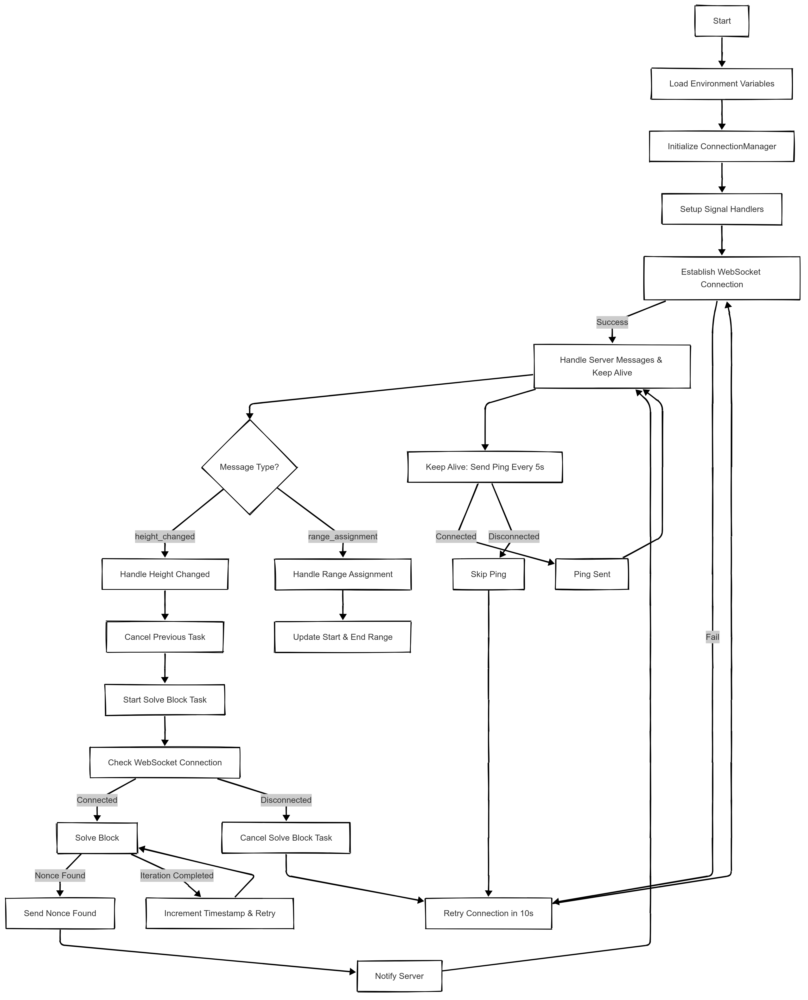
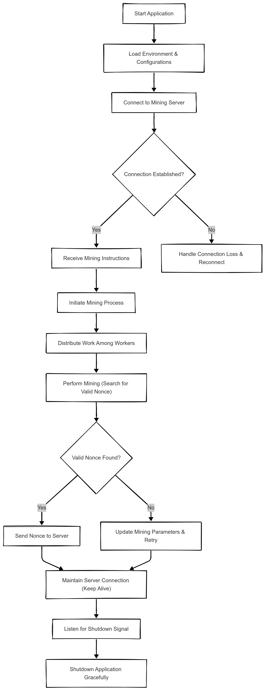

# Bitcoin Mining Pool & Miner Client - Efficient Cryptocurrency Mining Solution in Python

## Project Overview

This project encompasses a **Bitcoin Miner Pool** and a **Bitcoin Miner Client**, offering a comprehensive solution for mining Bitcoin. Built using **Python**, the mining pool runs a full Bitcoin node, fetches block templates, and distributes mining tasks to connected miners. The miner client efficiently connects to the pool, retrieves work, and uses multiprocessing for optimized mining performance.

### Key Features of Bitcoin Mining Pool

#### Bitcoin Node Integration

- **Runs a Bitcoin Node**: Utilizes the official Bitcoin Docker image to run a Bitcoin node for seamless blockchain interaction.

#### WebSocket-Based Mining Pool

- **WebSocket Server**: Supports multiple miners connecting simultaneously to the pool via a WebSocket server.

#### Efficient Block Template Fetching

- **Optimized Block Template Generation**: Retrieves block templates from the Bitcoin node's RPC URL for efficient mining operations.

#### Block Submission and Notifications

- **Submit Mined Blocks**: Allows the pool to submit valid mined blocks to the Bitcoin blockchain.
- **Telegram Notifications**: Sends real-time notifications via Telegram when a block is successfully submitted, keeping users informed about mining progress.

#### Scalable and Efficient

- **Scalable Infrastructure**: Designed to handle multiple miner connections, ensuring stability even under heavy load.
- **Optimized Mining Efficiency**: Implements enhancements in block template generation to improve mining operations.

### Key Features of Bitcoin Miner Client

#### Multiprocessing Support for Optimized Mining

- **Distribute Workload Across CPU Cores**: Leverages multiprocessing to divide the mining workload efficiently across multiple CPU cores.

#### Seamless WebSocket Integration

- **WebSocket Connection**: The client connects to the mining pool server to receive mining jobs and transmit solutions.

#### Robust Mining Process Management

- **Efficient Job Handling**: Manages mining tasks effectively, ensuring quick submission of valid mining solutions.

#### Automatic Reconnection & Graceful Shutdown

- **Auto-Reconnect**: The client automatically reconnects in case of connection loss to ensure continuous mining.
- **Graceful Shutdown**: Listens for shutdown signals and terminates mining operations smoothly, preventing data loss.

## Mining Pool Process Flow



## Bitcoin Miner Client Process Flow



### How to Set Up the Bitcoin Mining Pool & Miner Client

To set up the Bitcoin mining pool and miner client on your local machine, follow these steps:

1. Clone the repository from GitHub:

```sh
git clone https://github.com/merohitnishad/Bitcoin-Mining-Pool-Miner.git
```

2. Navigate into the project directory:

```sh
cd Bitcoin-Mining-Pool-Miner
```

3. Run the mining pool and miner client using Docker:

```sh
make run
```

4. To stop the node, use the following command:

```sh
make stop
```

This will start:

- The Bitcoin node server
- The mining pool server
- The miner client

After setup, miners can connect and start mining Bitcoin efficiently.

## Author Information

**Rohit Nishad**

- GitHub: [merohitnishad](https://github.com/merohitnishad)
- Website: [rohitnishad.com](https://rohitnishad.com/)
- LinkedIn: [merohitnishad](https://www.linkedin.com/in/merohitnishad/)

---
